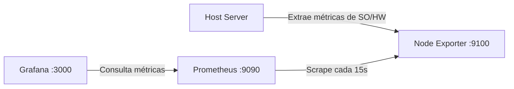

# 📊 Infrastructure Monitoring Stack (Prometheus + Grafana + Node Exporter)


Proyecto de infraestructura como código (**IaC**) para el monitoreo de métricas de hardware y sistema operativo del host en tiempo real. Utiliza contenedores orquestados con **Docker Compose** y provisioning declarativo para evitar configuraciones manuales.

---

## 📸 Vista Previa del Dashboard


---

## 🏗️ Arquitectura del Sistema

El flujo de métricas y la interacción entre contenedores se distribuye de la siguiente manera:



---

## 🚀 Servicios y Puertos

| Servicio | Puerto Local | Descripción |
| :--- | :--- | :--- |
| **Node Exporter** | `:9100` | Agente para la recolección de métricas del host (CPU, RAM, Discos, Red). |
| **Prometheus** | `:9090` | Base de datos de series temporales configurada para hacer *scraping* cada 15s. |
| **Grafana** | `:3000` | Plataforma de visualización de métricas y tableros interactivos. |

---

## 🛠️ Automatización e Infraestructura como Código (IaC)

Toda la plataforma se aprovisiona automáticamente al iniciar el entorno, sin requerir clics ni ajustes manuales en las interfaces web:

* **Aprovisionamiento de Data Source:** `grafana/provisioning/datasources/prometheus.yml`  
  Conecta automáticamente Prometheus como fuente de datos predeterminada al arrancar Grafana.
* **Aprovisionamiento de Dashboards:** `grafana/provisioning/dashboards/dashboards.yml`  
  Configura a Grafana para escanear y cargar de forma automática los paneles en la carpeta local.
* **Carga de Dashboard:** `grafana/dashboards/node-exporter.json`  
  Exportación completa del tablero de la comunidad (*Node Exporter Full*) listo para usar.

---

## 🔍 Diagnóstico y Solución de Problemas (Troubleshooting)

Durante la fase de despliegue inicial se diagnosticaron y solucionaron los siguientes errores de sintaxis:

1. **Prometheus (`prometheus.yml`):**
   * *Error:* Errata de tipeo `scrape_internal`.
   * *Solución:* Se corrigió al parámetro oficial de Prometheus `scrape_interval`.
2. **Node Exporter (`compose.yml`):**
   * *Error:* Flags mal formateados usando barras (`--path/procfs`).
   * *Solución:* Se ajustaron los flags a la sintaxis oficial apuntando al sistema de archivos del host (`--path.procfs=/host/proc`).

---

## 📂 Estructura del Proyecto

```text
.
├── docker-compose.yml
├── prometheus/
│   └── prometheus.yml
├── grafana/
│   ├── provisioning/
│   │   ├── datasources/
│   │   │   └── prometheus.yml
│   │   └── dashboards/
│   │       └── dashboards.yml
│   └── dashboards/
│       └── node-exporter.json
├── screenshots/
│   └── image_e30c07.png
└── .gitignore
```

---

## ⚡ Guía de Despliegue

### Requisitos Previos
* [Docker Desktop](https://www.docker.com/) o Docker Engine con Docker Compose instalado.

### Pasos para Ejecutar

1. Clonar el repositorio:
   ```bash
   git clone https://github.com/tu-usuario/tu-repositorio.git
   cd tu-repositorio
   ```

2. Levantar el stack en segundo plano:
   ```bash
   docker compose up -d
   ```

3. Abrir en el navegador:
   * **Grafana:** `http://localhost:3000`
   * **Prometheus:** `http://localhost:9090`
   * **Node Exporter Metrics:** `http://localhost:9100/metrics`
