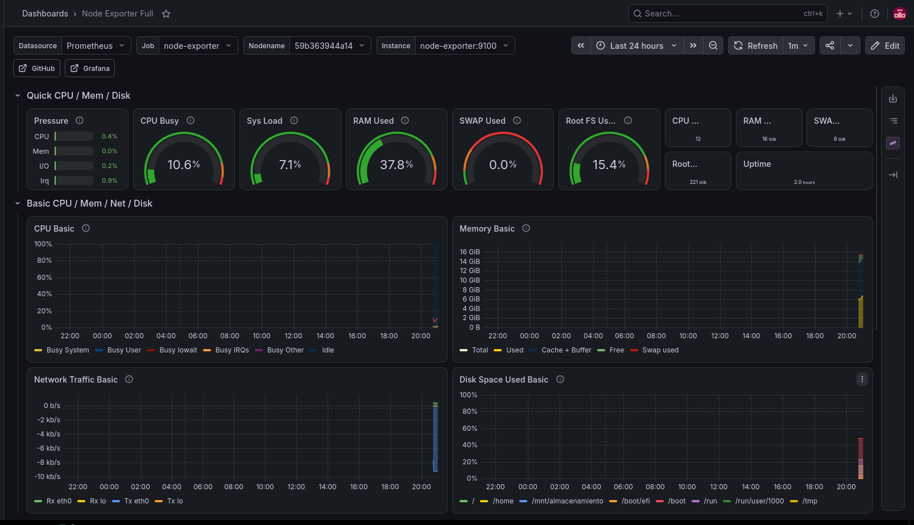
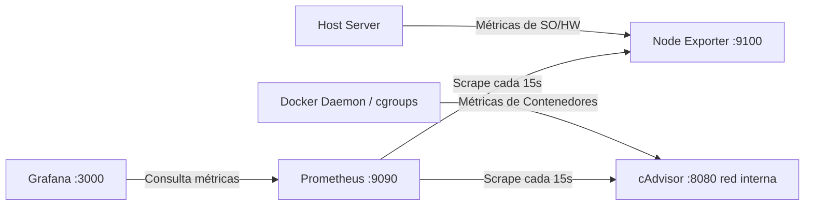

# 📊 Infrastructure & Container Monitoring Stack (Prometheus + Grafana + Node Exporter + cAdvisor)


Proyecto de infraestructura como código (**IaC**) para el monitoreo en tiempo real del sistema operativo host y de los contenedores Docker en ejecución. Utiliza contenedores orquestados con **Docker Compose** y provisioning declarativo para evitar configuraciones manuales.

---

## 📸 Vista Previa del Dashboard



---

## 🏗️ Arquitectura del Sistema

El flujo de métricas y la interacción entre contenedores se distribuye de la siguiente manera:



## 🚀 Servicios y Red

| Servicio | Puerto Host | Puerto Interno | Descripción |
| :--- | :--- | :--- | :--- |
| **Node Exporter** | `:9100` | `:9100` | Agente para la recolección de métricas del host (CPU, RAM, Discos, Red). |
| **cAdvisor** | *No publicado* | `:8080` | Analizador de uso de recursos y rendimiento de los contenedores Docker vía cgroups. |
| **Prometheus** | `:9090` | `:9090` | Base de datos de series temporales configurada para hacer *scraping* cada 15s. |
| **Grafana** | `:3000` | `:3000` | Plataforma de visualización de métricas y tableros interactivos. |

> **Nota sobre cAdvisor:** No expone puertos al host para evitar conflictos de puertos locales. Prometheus interactúa con él directamente a través de la red interna de Docker.

---

## 🛠️ Automatización e Infraestructura como Código (IaC)

Toda la plataforma se aprovisiona automáticamente al iniciar el entorno, sin requerir clics ni ajustes manuales en las interfaces web:

* **Aprovisionamiento de Data Source:** `grafana/provisioning/datasources/prometheus.yml`  
  Conecta automáticamente Prometheus como fuente de datos predeterminada al arrancar Grafana.
* **Aprovisionamiento de Dashboards:** `grafana/provisioning/dashboards/dashboards.yml`  
  Configura a Grafana para escanear y cargar de forma automática los paneles en la carpeta local.
* **Carga de Dashboard Personalizado:** `grafana/dashboards/node-exporter.json`  
  Tablero unificado que combina las métricas de hardware del sistema (*Node Exporter*) con paneles personalizados para el consumo de CPU por contenedor individual (*cAdvisor*).

---

## 📂 Estructura del Proyecto

```text
.
├── docker-compose.yml
├── prometheus/
│   └── prometheus.yml
├── grafana/
│   ├── provisioning/
│   │   ├── datasources/
│   │   │   └── prometheus.yml
│   │   └── dashboards/
│   │       └── dashboards.yml
│   └── dashboards/
│       └── node-exporter.json
├── screenshots/
│   └── grafana-dashboard.png
└── .gitignore
```

