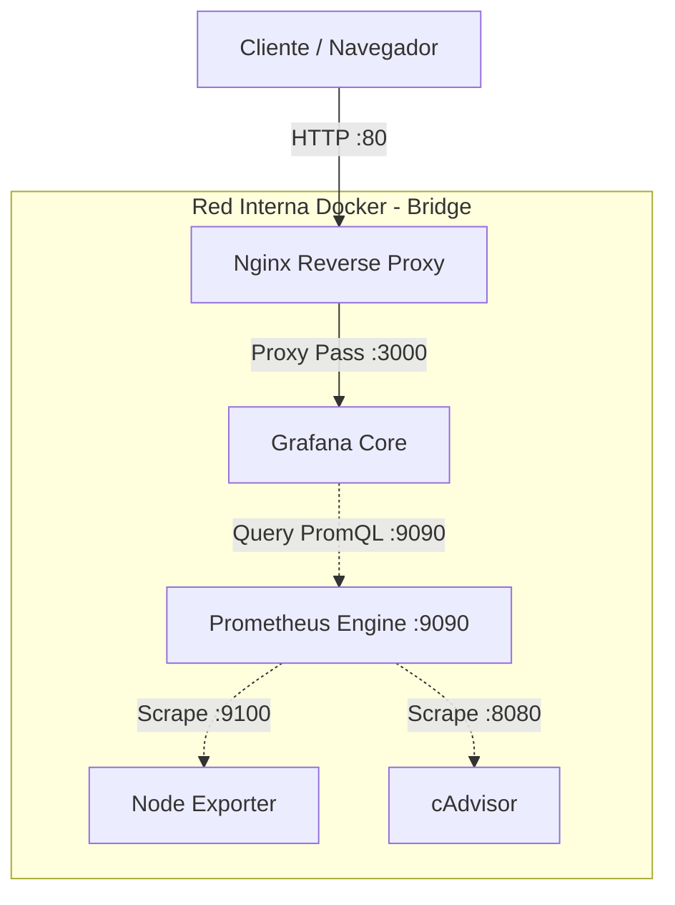

# 📊 Infrastructure & Container Observability Stack


Entorno de infraestructura como código (**IaC**) reproducible para el monitoreo integral del sistema operativo anfitrión y contenedores Docker en ejecución. 

Implementa **Nginx como Reverse Proxy perimetral** para aislar las interfaces de administración interna (**Grafana** y **Prometheus**), recolecta métricas en tiempo real mediante **Node Exporter** y **cAdvisor**, y aprovisiona fuentes de datos y tableros de forma declarativa (*Dashboards-as-Code*).

---

## 📸 Vista Previa del Monitoreo

Consumo de hardware del host (CPU, memoria, discos, red) correlacionado con el uso de recursos individual por contenedor Docker.


---

## 🏗️ Arquitectura del Sistema



## 🚀 Servicios y Topología de Red

| Servicio | Puerto Host | Puerto Interno | Rol Arquitectónico |
| :--- | :--- | :--- | :--- |
| **Nginx** | `:80` | `:80` | Gateway perimetral y Reverse Proxy hacia Grafana. |
| **Grafana** | *No publicado* | `:3000` | Visualización de tableros. Solo accesible a través del proxy en `http://localhost`. |
| **Prometheus** | *No publicado* | `:9090` | Base de datos de series temporales (TSDB). Solo accesible en red interna por Grafana. |
| **Node Exporter** | *No publicado* | `:9100` | Agente del host físico/virtual (CPU, memoria, disco, red). |
| **cAdvisor** | *No publicado* | `:8080` | Analizador de métricas de contenedores Docker a nivel kernel (`cgroups`). |

> **Hardening y Aislamiento Perimetral:** Ningún servicio interno (Prometheus, Grafana, exporters) expone sockets directamente al sistema anfitrión. El tráfico HTTP externo se centraliza exclusivamente por el puerto `:80` gestionado por Nginx.

---

## 🛠️ Automatización y Configuración Declarativa (IaC)

El entorno se inicia completamente operativo sin requerir intervención manual en las interfaces web:

* **Data Source Declarativo (`grafana/provisioning/datasources/`):** Conecta a Prometheus como origen de datos predeterminado de forma automática.
* **Dashboards Declarativos (`grafana/provisioning/dashboards/`):** Escanea e importa los paneles JSON del repositorio al iniciar Grafana.
* **Dashboard Unificado (`grafana/dashboards/node-exporter.json`):** Tablero integral que combina métricas de sistema anfitrión con el desglose de recursos por contenedor vía cAdvisor.

---

## 📂 Estructura del Repositorio

```text
.
├── compose.yml
├── nginx/
│   └── nginx.conf
├── prometheus/
│   └── prometheus.yml
├── grafana/
│   ├── provisioning/
│   │   ├── datasources/
│   │   │   └── prometheus.yml
│   │   └── dashboards/
│   │       └── dashboards.yml
│   └── dashboards/
│       └── node-exporter.json
├── screenshots/
│   └── cluster-metrics.png
└── .gitignore
```

---

## ⚡ Puesta en Marcha Rápida (Quickstart)

### 1. Requisitos Previos
- Docker Engine 24+ y Docker Compose v2.

### 2. Despliegue
```bash
# Clonar el repositorio
git clone [https://github.com/NehuenCacabelos/lab-monitoring.git](https://github.com/NehuenCacabelos/lab-monitoring.git)
cd lab-monitoring

# Levantar toda la infraestructura en segundo plano
docker compose up -d
```

### 3. Puntos de Entrada
* **Grafana:** `http://localhost` *(Credenciales por defecto: `admin` / `admin`)*
