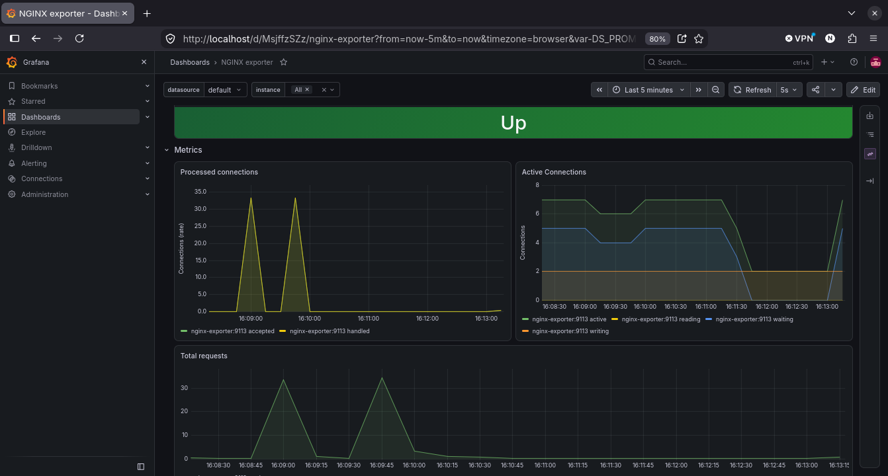
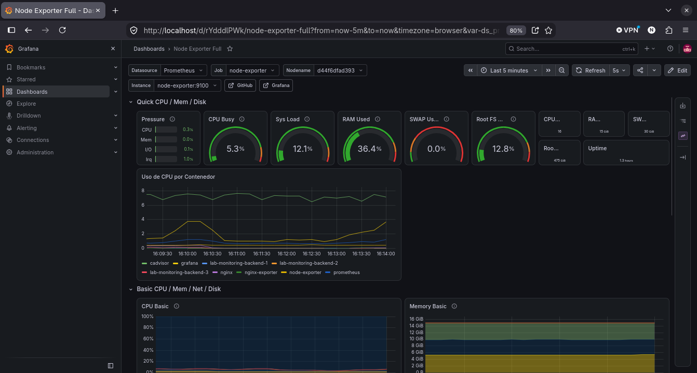
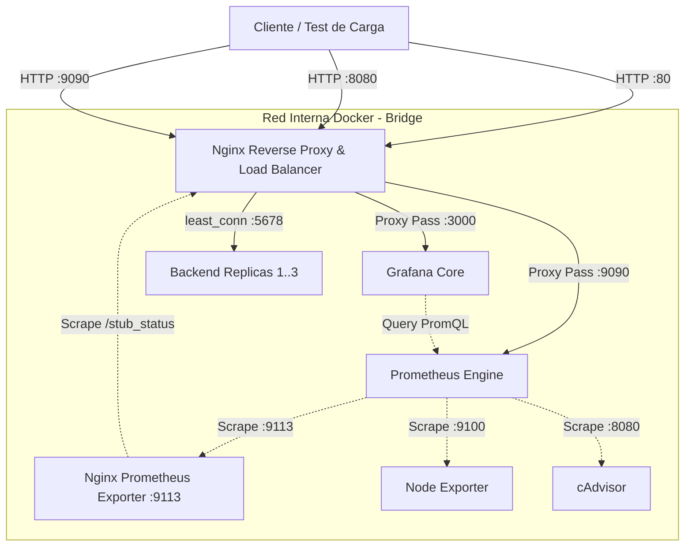

# 📊 Edge Proxy, Load Balancing & Observability Stack


Entorno de infraestructura como código (**IaC**) reproducible enfocado en **seguridad perimetral, balanceo de carga L7 y telemetría de extremo a extremo**. 

El stack utiliza **Nginx** como punto de entrada único (*Reverse Proxy* y *Load Balancer* con algoritmo `least_conn`), aislando los servicios internos de gestión (**Prometheus** y **Grafana**), y desplegando observabilidad integral en tiempo real mediante **Node Exporter**, **cAdvisor** y **Nginx Prometheus Exporter**. Todo el aprovisionamiento de dashboards y fuentes de datos se gestiona de forma declarativa (*Dashboards-as-Code*).

---

## 📸 Vistas Previas del Monitoreo

### 1. Tráfico y Rendimiento de Nginx (Caja Blanca)
Monitoreo de conexiones activas, estados del worker y tasa de peticiones atendidas por el balanceador.


### 2. Recursos del Host y Consumo por Contenedor (Caja Negra)
Métricas de CPU, memoria RAM y saturación individual de los contenedores Docker en ejecución.


---

## 🏗️ Arquitectura del Sistema

El flujo de tráfico HTTP y el ciclo de scraping de métricas se estructura en dos capas:



## 🚀 Servicios y Topología de Red

| Servicio | Puerto Host | Puerto Interno | Rol Arquitectónico |
| :--- | :--- | :--- | :--- |
| **Nginx** | `:80`, `:8080`, `:9090` | `:80`, `:8080`, `:9090` | Gateway perimetral, Reverse Proxy y Load Balancer. |
| **Backend Cluster** | *No publicado* | `:5678` | Clúster de 3 réplicas balanceadas por Nginx mediante `least_conn`. |
| **Grafana** | *No publicado* | `:3000` | Visualización de tableros. Solo accesible a través del proxy en `http://localhost`. |
| **Prometheus** | *No publicado* | `:9090` | TSDB para almacenamiento y PromQL. Accesible vía Nginx en `http://localhost:9090`. |
| **Nginx Exporter** | *No publicado* | `:9113` | Traduce el módulo `/stub_status` de Nginx a métricas compatibles con OpenMetrics. |
| **Node Exporter** | `:9100` | `:9100` | Agente del host físico/virtual (CPU, memoria, disco, red). |
| **cAdvisor** | *No publicado* | `:8080` | Analizador de métricas de contenedores a nivel kernel (`cgroups`). |

> **Hardening de Puertos:** Ni Grafana ni Prometheus exponen sockets directamente al sistema operativo host. Nginx actúa como escudo perimetral, previniendo accesos directos no intermediados.

---

## 🛠️ Automatización y Configuración Declarativa (IaC)

El despliegue no requiere pasos manuales en interfaces gráficas; arranca 100% operativo mediante archivos de aprovisionamiento:

* **Data Source Declarativo (`grafana/provisioning/datasources/`):** Conecta a Prometheus como origen de datos por defecto al inicializar el contenedor.
* **Dashboards Declarativos (`grafana/provisioning/dashboards/`):** Escanea automáticamente la carpeta de dashboards JSON e importa las interfaces sin interacción manual.
* **Dashboards Provistos:**
  * `node-exporter.json`: Métricas de hardware del sistema anfitrión correlacionadas con el consumo de recursos de cada contenedor Docker.
  * `nginx-exporter.json`: Métricas de capa de aplicación de Nginx (throughput de peticiones, conexiones concurrentes y estados del worker).

---

## 📂 Estructura del Repositorio

```text
.
├── compose.yml
├── nginx/
│   └── nginx.conf
├── prometheus/
│   └── prometheus.yml
├── grafana/
│   ├── provisioning/
│   │   ├── datasources/
│   │   │   └── prometheus.yml
│   │   └── dashboards/
│   │       └── dashboards.yml
│   └── dashboards/
│       ├── nginx-exporter.json
│       └── node-exporter.json
├── scripts/
│   └── load-test.sh
├── screenshots/
│   ├── nginx-metrics.png
│   └── cluster-metrics.png
└── .gitignore
```

## ⚡ Puesta en Marcha Rápida (Quickstart)

### 1. Requisitos Previos
- Docker Engine 24+ y Docker Compose v2.

### 2. Despliegue
```bash
# Clonar el repositorio
git clone https://github.com/NehuenCacabelos/lab-monitoring.git
cd lab-monitoring

# Levantar toda la infraestructura en segundo plano
docker compose up -d
```

### 3. Puntos de Entrada
* **Grafana:** `http://localhost` *(Credenciales por defecto: `admin` / `admin`)*
* **Prometheus:** `http://localhost:9090`
* **Backend Balanceado:** `http://localhost:8080`

---

## 🧪 Pruebas de Carga y Validación del Balanceador

Para validar la distribución de peticiones entre las réplicas del clúster y observar las curvas de saturación en Grafana:

```bash
# Generar tráfico concurrente contra el balanceador
./scripts/load-test.sh
```

Para verificar en tiempo real cómo Nginx reparte las solicitudes entre los distintos contenedores:

```bash
docker compose logs backend --tail=20 -f
```
